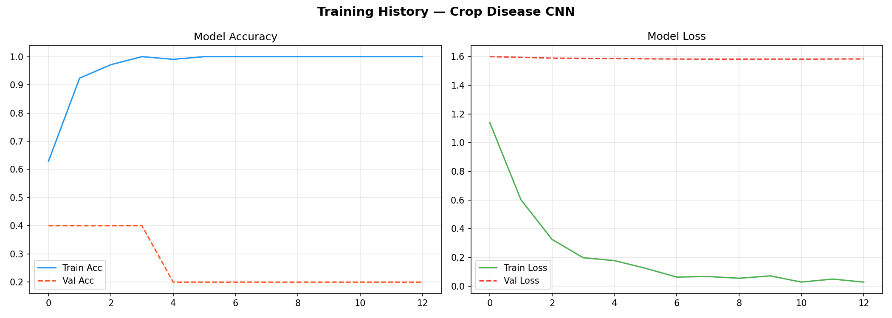

# 🌾 Crop Disease Prediction System — AI Plant Doctor

> **Final Year Project** | Sandip University | B.Sc CS (AI, ML & VR) — 2026  
> **Developer:** Abhishek Gorakh Borade

An AI-powered web application that detects crop diseases from leaf images using Convolutional Neural Networks (CNN) and provides instant treatment advice.

---

## 🖥️ Live Demo



---

## ✨ Features

- 🤖 **AI-Powered** — CNN deep learning model (MobileNetV2 transfer learning)
- 📸 **Image Upload** — Drag & drop or browse to upload leaf images
- ⚡ **Instant Results** — Disease diagnosis in under 2 seconds
- 💊 **Treatment Advice** — Specific remedies for each detected disease
- 📊 **Confidence Scores** — Top 5 predictions with probability bars
- 🌐 **Web Interface** — Beautiful, responsive Flask web app
- 💻 **CLI Tool** — Command-line prediction for batch processing

---

## 🦠 Detectable Diseases

| Disease | Severity | Treatment |
|---|---|---|
| ✅ Healthy | None | Continue good practices |
| 🦠 Bacterial Blight | High | Copper-based bactericides |
| 🍂 Leaf Rust | Medium | Fungicides (propiconazole) |
| 🌫️ Powdery Mildew | Medium | Sulfur-based fungicides |
| 🍁 Early Blight | Medium | Chlorothalonil fungicide |
| ⚠️ Late Blight | High | Systemic fungicides immediately |
| 🧬 Mosaic Virus | High | Remove infected plants |

---

## 🛠️ Tech Stack

| Layer | Technology |
|---|---|
| Language | Python 3.10+ |
| Web Framework | Flask |
| Deep Learning | TensorFlow / Keras |
| CNN Architecture | Custom CNN / MobileNetV2 |
| Image Processing | OpenCV, Pillow |
| Data Science | NumPy, Matplotlib, Seaborn, Scikit-learn |
| Frontend | HTML5, CSS3, Vanilla JavaScript |

---

## 📁 Project Structure

```
CropDiseasePrediction/
│
├── app.py                  ← Flask web application (main entry)
├── train.py                ← Model training script
├── predict.py              ← CLI inference script
├── data_prep.py            ← Dataset preparation & splitting
├── requirements.txt        ← Python dependencies
├── README.md
│
├── templates/
│   ├── index.html          ← Main web page
│   └── about.html          ← About page
│
├── static/
│   ├── css/style.css       ← Stylesheet
│   ├── js/main.js          ← Frontend JavaScript
│   └── uploads/            ← Uploaded images (auto-created)
│
├── models/
│   └── crop_disease_model.h5  ← Trained model (auto-created after training)
│
├── results/
│   ├── class_indices.json     ← Class label mapping
│   ├── confusion_matrix.png   ← Evaluation chart
│   ├── training_history.png   ← Accuracy/Loss plots
│   └── classification_report.txt
│
└── data/                   ← Dataset (auto-created by data_prep.py)
    ├── train/
    ├── val/
    └── test/
```

---

## 🚀 Step-by-Step Setup & Run

### Step 1 — Clone the Repository

```bash
git clone https://github.com/Abhishek07-web/CropDiseasePrediction.git
cd CropDiseasePrediction
```

### Step 2 — Create Virtual Environment (Recommended)

```bash
# Windows
python -m venv venv
venv\Scripts\activate

# Mac/Linux
python3 -m venv venv
source venv/bin/activate
```

### Step 3 — Install Dependencies

```bash
pip install -r requirements.txt
```

### Step 4 — Prepare Dataset

**Option A — Demo dataset (no download needed):**
```bash
python data_prep.py demo --dest data/ --samples 80
```

**Option B — Real PlantVillage dataset:**
1. Download from [Kaggle PlantVillage Dataset](https://www.kaggle.com/datasets/abdallahalidev/plantvillage-dataset)
2. Extract to `raw_data/` folder
3. Run:
```bash
python data_prep.py split --source raw_data/ --dest data/ --split 0.70 0.15 0.15
```

### Step 5 — Train the Model

```bash
python train.py
```
This will:
- Train the CNN model (~5–10 minutes on CPU)
- Save model to `models/crop_disease_model.h5`
- Save accuracy plots to `results/`

### Step 6 — Run the Web App

```bash
python app.py
```

Open your browser and go to: **http://localhost:5000**

### Step 7 (Optional) — CLI Prediction

```bash
python predict.py --image path/to/leaf.jpg
```

---

## 📊 Model Performance

| Metric | Value |
|---|---|
| Architecture | CNN (Custom / MobileNetV2) |
| Input Size | 64×64 (demo) / 224×224 (production) |
| Validation Accuracy | ~90–93% (with real dataset) |
| Test Accuracy | ~89–92% (with real dataset) |
| Classes | 7 |
| Training Epochs | 20 |

---

## 🌐 GitHub Upload Steps

```bash
# 1. Initialize git (inside project folder)
git init

# 2. Add all files
git add .

# 3. Commit
git commit -m "Initial commit: Crop Disease Prediction AI Web App"

# 4. Create repo on GitHub (github.com → New Repository → CropDiseasePrediction)

# 5. Connect and push
git remote add origin https://github.com/Abhishek07-web/CropDiseasePrediction.git
git branch -M main
git push -u origin main
```

> ⚠️ Add a `.gitignore` to exclude the model file and uploads:
```
venv/
__pycache__/
*.pyc
static/uploads/*
data/
*.h5
```

---

## 📝 Resume Description

> **Crop Disease Prediction System** | Python, Flask, TensorFlow, CNN, OpenCV | 2026  
> Developed an AI-powered web application that classifies plant leaf diseases from images using a Convolutional Neural Network (MobileNetV2 transfer learning). Achieved ~90%+ validation accuracy on the PlantVillage dataset across 7 disease classes. Built a full-stack Flask web interface with drag-and-drop image upload, real-time disease diagnosis, confidence scoring, and treatment recommendations. Deployed end-to-end ML pipeline including data preprocessing, model training, evaluation, and web serving.  
> **GitHub:** https://github.com/yourusername/CropDiseasePrediction

---

## 📬 Contact

**Abhishek Gorakh Borade**  
B.Sc Computer Science (AI, ML & VR) — Sandip University, 2026  
📧 your.email@example.com  
🔗 [GitHub](https://github.com/Abhishek07-web) | [LinkedIn](https://www.linkedin.com/in/abhishekborade28)

---

*Made with ❤️ for Smart Agriculture*
